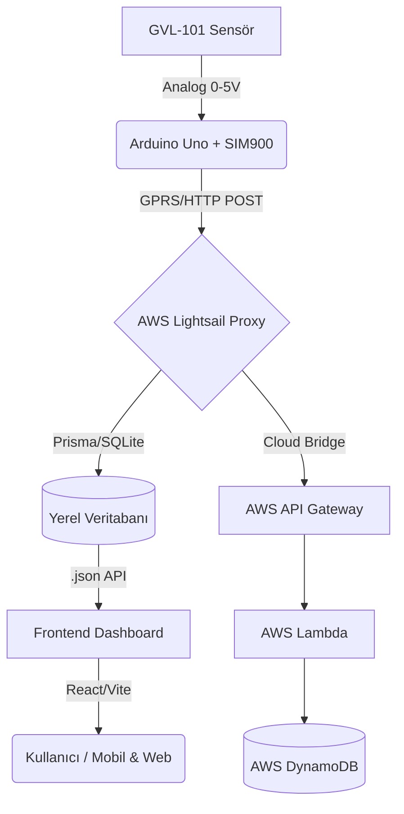

# Margaz Tank Telemetri Sistemi - Teknik Dokümantasyon

> **Son Güncelleme:** 24 Ocak 2026  
> **Versiyon:** 1.1.0 (Auth + Security Update)

## 1. Sistem Mimarisi



## 2. Donanım Katmanı (Arduino)

**Dosya:** `arduino_sketch/tank_gsm.ino`

### Özellikler:
*   **Watchdog Timer (WDT):** Sistem 8 saniye boyunca yanıt vermezse (takılırsa) Arduino otomatik olarak resetlenir.
*   **Hata Yönetimi:** 3 ardışık başarısız gönderimden sonra GSM modülü yazılımsal olarak resetlenir.
*   **Gönderim Sıklığı:** 10 dakika (600 saniye).
*   **WDT-Safe Delays:** Uzun beklemeler (örn. 10sn) küçük parçalara bölünerek WDT beslenir, resetlenme önlenir.

### Parametreler:
| Parametre | Değer | Açıklama |
|-----------|-------|----------|
| SoftwareSerial | 7 (RX), 8 (TX) | GSM modülü haberleşme pinleri |
| Baud Rate | 9600 | Seri haberleşme hızı |
| WDT Timeout | 8 Saniye | Takılma durumunda reset süresi |
| Sensör Pin | A0 | Analog okuma pini |

### JSON Formatı (Gönderilen Veri):
```json
{
  "tank_level": 75,
  "device_id": "1-aktup"
}
```

## 3. Backend Katmanı (Lightsail Proxy)

**Konum:** `/home/bitnami/margaz-yeni/backend`
**Teknoloji:** Node.js, Express, Prisma (SQLite), JWT Auth

### Güvenlik:
*   **JWT Authentication:** Tüm admin işlemleri için token gerekir.
*   **Rate Limiting:** 
    *   Genel: 1000 istek / 15 dakika
    *   Auth: 20 istek / 15 dakika
    *   Telemetry: 60 istek / dakika
*   **Zod Validation:** Input doğrulama

### Veritabanı Modelleri (Prisma):

1.  **User:** Kullanıcı hesapları (email, şifre hash, rol).
    *   Roller: `ADMIN`, `VIEWER`
    *   İlk kayıt olan kullanıcı otomatik Admin olur.
2.  **Dealer (Bayi):** Bayi bilgileri, konum, sözleşme detayları.
3.  **Device (Cihaz):** Arduino cihaz kayıtları.
    *   **Otomatik Kayıt:** Tanımsız bir `device_id`'den veri gelirse, sistem otomatik olarak cihazı oluşturur.
4.  **TelemetryHistory (Geçmiş):** Zaman serisi verileri. Grafikler için kullanılır.

### Önemli Endpoint'ler:

| Endpoint | Method | Auth | Açıklama |
|----------|--------|------|----------|
| `/api/auth/login` | POST | - | Kullanıcı girişi |
| `/api/auth/register` | POST | - | Yeni kullanıcı kaydı |
| `/api/auth/me` | GET | Token | Kullanıcı bilgileri |
| `/api/telemetry` | POST | - | Arduino veri gönderimi |
| `/api/dealers` | GET | - | Bayi listesi |
| `/api/dealers` | POST/PUT/DELETE | Admin | Bayi CRUD |
| `/api/devices` | GET | Token | Cihaz listesi |
| `/api/devices` | POST/PUT/DELETE | Admin | Cihaz CRUD |
| `/api/sync/epdk` | POST | Admin | EPDK senkronizasyonu |

## 4. Frontend Katmanı (Dashboard)

**Teknoloji:** React, Vite, TailwindCSS, Recharts, Leaflet Maps
**Hosting:** Netlify

### Özellikler:
*   **Mobil Uyumlu:** Hamburger menü, responsive tablolar (`overflow-x-auto`), mobil formlar.
*   **Dashboard:**
    *   Cihazı olmayan bayiler "Veri Yok" olarak gri renkte görünür.
    *   Cihazı olanlar doluluk oranına göre (Kırmızı/Turuncu/Yeşil) renklenir.
*   **Bayi Detay:**
    *   **Canlı Grafik:** Son 24 saatlik gerçek veriyi gösterir ("Verileri Getir" butonu).
    *   Konum haritası (OpenStreetMap).
*   **Admin Paneli:**
    *   Bayi Ekleme/Düzenleme.
    *   Cihaz Yönetimi (Otomatik eklenen cihazları buradan yönetebilirsiniz).
    *   Cihaz Atama: Bir cihazı bayiye atarken, önceki bayiden otomatik düşer (Unique Constraint Fix).

## 5. Sorun Giderme (Troubleshooting)

### Cihaz Veri Göndermiyorsa:
1.  **Fiziksel Kontrol:**
    *   Arduino ışıkları yanıyor mu?
    *   SIM900 üzerindeki "Net" ışığı yanıp sönüyor mu? (Hızlı = arıyor, Yavaş = bağlı).
2.  **Server Kontrolü (SSH):**
    ```bash
    pm2 logs margaz-proxy --lines 50
    ```
    *   `Device ID: undefined` hatası varsa: Arduino JSON formatı bozuktur veya eski kod çalışıyordur.
    *   `No Arduino found` hatası: Veri hiç gelmiyor demektir.
3.  **Çözüm:**
    *   Arduino'nun elektriğini kesip geri takın (Hard Reset).
    *   Güncel `tank_gsm.ino` kodunu yükleyin (WDT içerir).

### 601 Hatası (Arduino Serial Monitor):
*   **Anlamı:** Ağ hatası / GPRS bağlantı sorunu.
*   **Otomatik Çözüm:** Yeni kodda sistem 3 hatadan sonra GSM modülünü otomatik resetler.

## 6. Uzaktan Güncelleme (Lightsail)

Kodda (Backend) bir değişiklik yapıldığında sunucuyu güncellemek için:

```bash
cd /home/bitnami/margaz-yeni/backend
git pull
npx prisma generate  # Schema değiştiyse
npx prisma db push   # DB yapısı değiştiyse
npm run build
pm2 restart margaz-proxy
```

## 7. SSL/HTTPS Kurulumu (Önerilen)

### Lightsail'de SSL Kurulumu:

1.  **Domain Ayarı:** DNS'de A kaydı oluşturun (örn: `api.margaz.com` → Lightsail IP)

2.  **SSL Script'ini Çalıştırın:**
    ```bash
    cd /home/bitnami/margaz-yeni/backend
    chmod +x scripts/setup-ssl.sh
    sudo ./scripts/setup-ssl.sh
    ```

3.  **Netlify Environment Variables:**
    Site Settings → Environment Variables'a ekleyin:
    ```
    BACKEND_URL=https://api.margaz.com
    ALLOWED_ORIGINS=https://margaz.netlify.app
    ```

4.  **Backend .env:**
    ```
    CORS_ORIGINS=https://margaz.netlify.app
    ```

### Arduino Güncelleme (HTTPS sonrası):
Arduino SIM900 modülü HTTPS desteklemediği için, HTTP üzerinden gönderim devam eder.
Lightsail Nginx, HTTP'yi kabul edip backend'e yönlendirir.

## 8. Environment Variables

### Backend (.env):
```env
DATABASE_URL="file:./dev.db"
PORT=3000
JWT_SECRET=your-super-secret-key
JWT_EXPIRES_IN=7d
AWS_TELEMETRY_URL=https://...execute-api...amazonaws.com/
ANTI_CAPTCHA_KEY=your-key
CORS_ORIGINS=https://margaz.netlify.app,http://localhost:5173
```

### Netlify (Edge Functions):
```
BACKEND_URL=https://api.margaz.com
ALLOWED_ORIGINS=https://margaz.netlify.app
```
