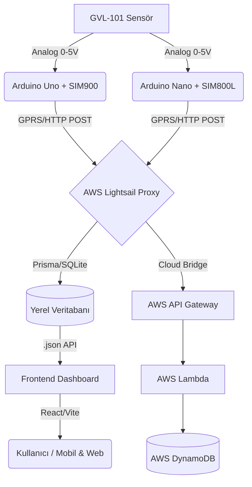

# Margaz Tank Telemetri Sistemi - Teknik Dokümantasyon

> **Son Güncelleme:** 05 Şubat 2026
> **Versiyon:** 1.1.3 (Frontend Tarih Aralığı)

## 1. Sistem Mimarisi



## 2. Donanım Katmanı (Arduino)

Bu sistem iki donanım profili ile çalışır:

### 2.1 Arduino Uno + SIM900 (Shield)

**Dosya:** `arduino_sketch/tank_gsm.ino` (repo dışında tutulur)

### Özellikler:
*   **Watchdog Timer (WDT):** Sistem 8 saniye boyunca yanıt vermezse (takılırsa) Arduino otomatik olarak resetlenir.
*   **Hata Yönetimi:** 3 ardışık başarısız gönderimden sonra GSM modülü yazılımsal olarak resetlenir.
*   **Gönderim Sıklığı:** 10 dakika (600 saniye).
*   **WDT-Safe Delays:** Uzun beklemeler (örn. 10sn) küçük parçalara bölünerek WDT beslenir, resetlenme önlenir.

### Parametreler:
| Parametre | Değer | Açıklama |
|-----------|-------|----------|
| SoftwareSerial | 7 (RX), 8 (TX) | SIM900 shield seri pinleri (jumper ayarına göre) |
| Baud Rate | 9600 | Seri haberleşme hızı |
| WDT Timeout | 8 Saniye | Takılma durumunda reset süresi |
| Sensör Pin | A0 | Analog okuma pini |

### 2.2 Arduino Nano + SIM800L

**Dosya:** `arduino_sketch/tank_gsm_v2_d3d2.ino` (repo dışında tutulur)

### Özellikler:
*   **Watchdog Timer (WDT):** 8 saniye (HTTP işlemlerinde güvenli reset).
*   **Gönderim Sıklığı:** 10 dakika (600 saniye).
*   **UART:** D3 (RX), D2 (TX) - SIM800L ile doğrulanmış pinler.
*   **Baud Rate:** 9600 (sabit).

### Parametreler:
| Parametre | Değer | Açıklama |
|-----------|-------|----------|
| SoftwareSerial | 3 (RX), 2 (TX) | SIM800L haberleşme pinleri |
| Baud Rate | 9600 | Seri haberleşme hızı |
| WDT Timeout | 8 Saniye | Takılma durumunda reset süresi |
| Sensör Pin | A0 | Analog okuma pini |

### JSON Formatı (Gönderilen Veri):
```json
{
  "tank_level": 75,
  "device_id": "1-aktup"
}
```

## 3. Backend Katmanı (Lightsail Proxy)

**Konum:** `/home/bitnami/margaz-yeni/backend`
**Teknoloji:** Node.js, Express, Prisma (SQLite), JWT Auth

### Güvenlik:
*   **JWT Authentication:** Tüm admin işlemleri için token gerekir.
*   **Rate Limiting:** 
    *   Genel: 1000 istek / 15 dakika
    *   Auth: 20 istek / 15 dakika
    *   Telemetry: 60 istek / dakika
*   **Zod Validation:** Input doğrulama

### Veritabanı Modelleri (Prisma):

1.  **User:** Kullanıcı hesapları (email, şifre hash, rol).
    *   Roller: `ADMIN`, `VIEWER`
    *   İlk kayıt olan kullanıcı otomatik Admin olur.
2.  **Dealer (Bayi):** Bayi bilgileri, konum, sözleşme detayları.
3.  **Device (Cihaz):** Arduino cihaz kayıtları.
    *   **Otomatik Kayıt:** Tanımsız bir `device_id`'den veri gelirse, sistem otomatik olarak cihazı oluşturur.
4.  **TelemetryHistory (Geçmiş):** Zaman serisi verileri. Grafikler için kullanılır.

### Önemli Endpoint'ler:

| Endpoint | Method | Auth | Açıklama |
|----------|--------|------|----------|
| `/api/auth/login` | POST | - | Kullanıcı girişi |
| `/api/auth/register` | POST | - | Yeni kullanıcı kaydı |
| `/api/auth/me` | GET | Token | Kullanıcı bilgileri |
| `/api/telemetry` | POST | - | Arduino veri gönderimi |
| `/api/dealers` | GET | - | Bayi listesi |
| `/api/dealers` | POST/PUT/DELETE | Admin | Bayi CRUD |
| `/api/dealers/:id/history` | GET | - | Grafik verisi (start/end veya hours) |
| `/api/devices` | GET | Token | Cihaz listesi |
| `/api/devices` | POST/PUT/DELETE | Admin | Cihaz CRUD |
| `/api/sync/epdk` | POST | Admin | EPDK senkronizasyonu |

## 4. Frontend Katmanı (Dashboard)

**Teknoloji:** React, Vite, TailwindCSS, Recharts, Leaflet Maps
**Hosting:** Netlify

### Özellikler:
*   **Mobil Uyumlu:** Hamburger menü, responsive tablolar (`overflow-x-auto`), mobil formlar.
*   **Dashboard:**
    *   Cihazı olmayan bayiler "Veri Yok" olarak gri renkte görünür.
    *   Cihazı olanlar doluluk oranına göre (Kırmızı/Turuncu/Yeşil) renklenir.
*   **Bayi Detay:**
    *   **Canlı Grafik:** Son 24 saatlik gerçek veriyi gösterir ("Verileri Getir" butonu).
    *   **Tarih Aralığı:** Başlangıç/bitiş tarih-saat seçilerek istenen aralık görüntülenir.
    *   Konum haritası (OpenStreetMap).
*   **Admin Paneli:**
    *   Bayi Ekleme/Düzenleme.
    *   Cihaz Yönetimi (Otomatik eklenen cihazları buradan yönetebilirsiniz).
    *   Cihaz Atama: Bir cihazı bayiye atarken, önceki bayiden otomatik düşer (Unique Constraint Fix).

## 5. Sorun Giderme (Troubleshooting)

### Cihaz Veri Göndermiyorsa:
1.  **Fiziksel Kontrol:**
    *   Arduino ışıkları yanıyor mu?
    *   SIM900 üzerindeki "Net" ışığı yanıp sönüyor mu? (Hızlı = arıyor, Yavaş = bağlı).
2.  **Server Kontrolü (SSH):**
    ```bash
    pm2 logs margaz-proxy --lines 50
    ```
    *   `Device ID: undefined` hatası varsa: Arduino JSON formatı bozuktur veya eski kod çalışıyordur.
    *   `No Arduino found` hatası: Veri hiç gelmiyor demektir.
3.  **Çözüm:**
    *   Arduino'nun elektriğini kesip geri takın (Hard Reset).
    *   Güncel `tank_gsm.ino` kodunu yükleyin (WDT içerir).

### 601 Hatası (Arduino Serial Monitor):
*   **Anlamı:** Ağ hatası / GPRS bağlantı sorunu.
*   **Otomatik Çözüm:** Yeni kodda sistem 3 hatadan sonra GSM modülünü otomatik resetler.

## 6. Uzaktan Güncelleme (Lightsail)

Kodda (Backend) bir değişiklik yapıldığında sunucuyu güncellemek için:

```bash
cd /home/bitnami/margaz-yeni/backend
git pull
npx prisma generate  # Schema değiştiyse
npx prisma db push   # DB yapısı değiştiyse
npm run build
pm2 restart margaz-proxy
```

## 7. SSL/HTTPS Kurulumu (Önerilen)

### Lightsail'de SSL Kurulumu:

1.  **Domain Ayarı:** DNS'de A kaydı oluşturun (örn: `api.margaz.com` → Lightsail IP)

2.  **SSL Script'ini Çalıştırın:**
    ```bash
    cd /home/bitnami/margaz-yeni/backend
    chmod +x scripts/setup-ssl.sh
    sudo ./scripts/setup-ssl.sh
    ```

3.  **Netlify Environment Variables:**
    Site Settings → Environment Variables'a ekleyin:
    ```
    BACKEND_URL=https://api.margaz.com
    ALLOWED_ORIGINS=https://margaz.netlify.app
    ```

4.  **Backend .env:**
    ```
    CORS_ORIGINS=https://margaz.netlify.app
    ```

### Arduino Güncelleme (HTTPS sonrası):
Arduino SIM900 modülü HTTPS desteklemediği için, HTTP üzerinden gönderim devam eder.
Lightsail Nginx, HTTP'yi kabul edip backend'e yönlendirir.

## 8. Environment Variables

### Backend (.env):
```env
DATABASE_URL="file:./dev.db"
PORT=3000
JWT_SECRET=your-super-secret-key (min 32 karakter)
JWT_EXPIRES_IN=7d
AWS_TELEMETRY_URL=https://...execute-api...amazonaws.com/
ANTI_CAPTCHA_KEY=your-key
CORS_ORIGINS=https://margaz.netlify.app,http://localhost:5173
```

### Netlify (Edge Functions):
```
BACKEND_URL=https://api.margaz.com
ALLOWED_ORIGINS=https://margaz.netlify.app
```

---

## 9. Sistem İyileştirme Geçmişi

### 30 Ocak 2026 - Phase 1: Kritik Hata Düzeltmesi

#### 9.1 tank_level Validasyonu Eklendi

**Sorun:**
- Arduino cihazlardan gelen telemetri verilerinde `tank_level` alanı bazen `undefined` geliyordu
- Bu durum Prisma'da "Argument 'tankLevel' is missing" hatasına neden oluyordu
- Veri kaybı ve sistem hataları meydana geliyordu

**Çözüm:**
- [`backend/src/routes/telemetry.routes.ts`](backend/src/routes/telemetry.routes.ts:10) dosyasına input validasyonu eklendi
- `tank_level` ve `device_id` alanları için zorunluluk kontrolü
- 0-100 aralığı validasyonu
- `NaN` kontrolü

**Değişiklikler:**
```typescript
// Validasyon eklendi
if (tank_level === undefined || tank_level === null) {
    res.status(400).json({ error: 'tank_level is required' });
    return;
}

const level = Number(tank_level);
if (isNaN(level) || level < 0 || level > 100) {
    res.status(400).json({ error: 'tank_level must be between 0-100' });
    return;
}
```

**Deploy:**
- Commit: `96ffb15`
- Lightsail'de başarıyla deploy edildi
- PM2 restart yapıldı
- Sistem stabil çalışıyor

**Sonuç:**
- ✅ Eksik veya hatalı veriler artık 400 Bad Request ile reddediliyor
- ✅ Sistem hataları önlendi
- ✅ Veri bütünlüğü sağlandı

---

## 10. Gelecek İyileştirmeler (Yol Haritası)

### Phase 1: Risksiz İşlemler
- [x] Swagger/OpenAPI dokümantasyonu
- [x] Frontend Error Boundaries
- [x] Frontend test coverage raporu
- [ ] Dokümantasyon takibi: `.md` dosyalarını `.gitignore` dışında tutma kararı (opsiyonel)

### Phase 2: Dikkatli İşlemler
- [x] PrismaClient singleton pattern (core uygulama)
- [x] JWT secret validasyonu (env kontrolü)
- [ ] Input validation genişletme (tüm route'lar)

### Phase 3: Yüksek Riskli İşlemler
- [ ] Database migration stratejisi düzeltme (`db push` → `migrate deploy`)
- [ ] API key sistemi (cihaz doğrulama)

### Phase 4: İsteğe Bağlı
- [ ] SQLite → PostgreSQL geçişi
- [ ] Docker containerization
- [ ] CI/CD pipeline

---

## 11. Son Çalışma Özeti

### 11.1 Frontend Test ve Coverage
- `npm test` başarıyla geçti (26 test, 16 suite)
- Coverage (v8): Statements 71.67%, Branches 59.72%, Functions 47.05%, Lines 71.67%
- Vite 5.4.21'e güncellendi (breaking yok)

### 11.2 Frontend Error Boundary
- Root seviyede Error Boundary eklendi
- Fallback ekranı Türkçe mesajlar ve yenileme butonu içerir

### 11.3 Backend 404 Davranışı
- Dealer/Device update/delete için P2025 artık 404 döndürüyor
- Commit: `75a7524`

### 11.4 Repo Takip Durumu
- `.md` ve Arduino dosyaları Git takibinden çıkarıldı (repo temizliği)
- Dosyalar lokal kalır, GitHub'da silinmiş görünür

### 11.5 Güncel Repo Durumu (Local)
- Push edilmemiş backend test altyapısı var (jest/supertest)
- `dev.db` ve `test.db` lokal veri olarak tutuluyor, repo'ya push edilmiyor

### 11.6 Prisma Singleton Notu
- Core uygulamada tek PrismaClient kullanılır
- Script/CLI ve test ortamı ayrı PrismaClient kullanır

### 11.7 Lightsail Notları
- `sqlite3` kuruldu ve `dev.db` yedeği alındı
- Backup dosyası: `backup-20260130.db`
- `/api/health` endpoint'i yok; 404 normal

### 11.8 JWT Validasyonu (Prod)
- `JWT_SECRET` kontrolü uygulandı (startup fail-fast)
- Lightsail deploy sonrası `pm2 restart` başarılı
- Smoke test: `GET /api/dealers` → 200 OK

### 11.9 OpenAPI / Swagger
- OpenAPI dosyası: `backend/docs/openapi.yaml`
- Swagger UI: `/docs` (admin JWT ile erişim)
- Doküman indirilebilir: `/docs/openapi.yaml` (admin JWT ile)
- JWT almak için: `POST /api/auth/login` → `token`
